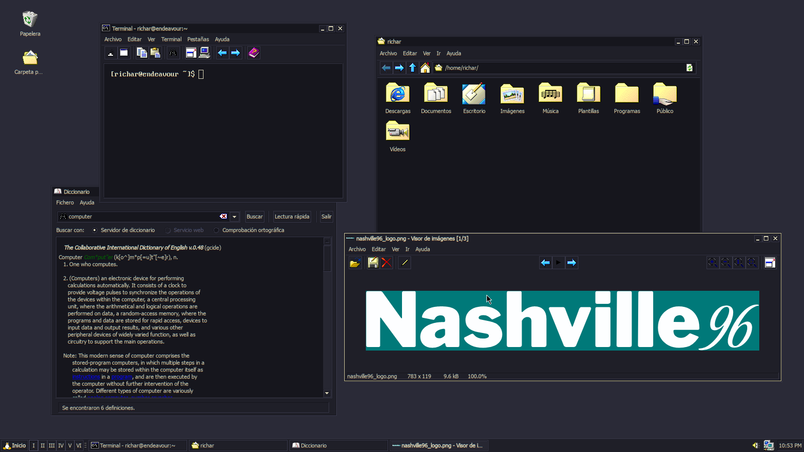
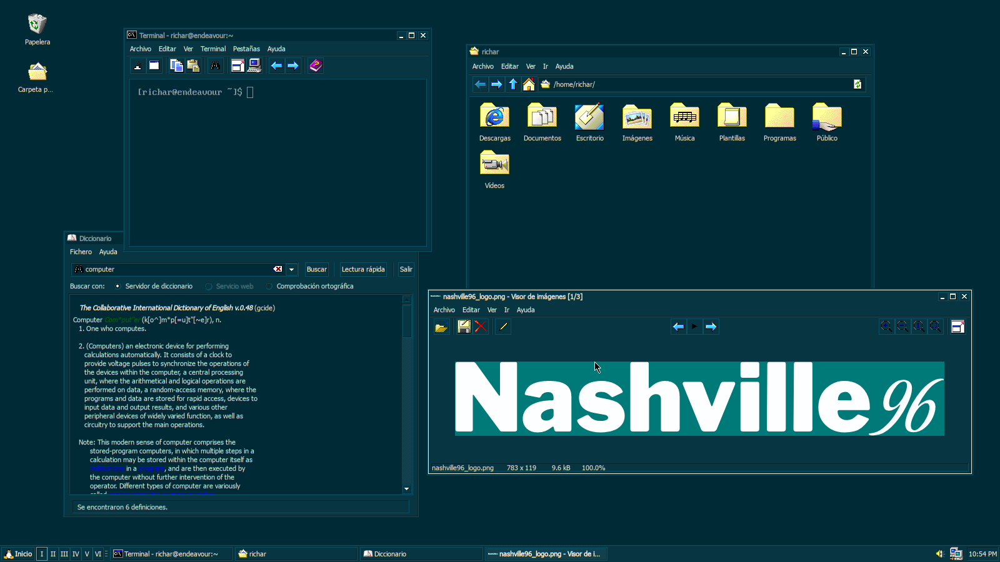

# Nashville96
<p align="center">
	
</p>

A collection of Windows-like GTK themes based on both [Chicago95](https://github.com/grassmunk/Chicago95) (for GTK3) and [Redmond97](https://github.com/matthewmx86/Redmond97) (for GTK2) incoporating some color schemes. If you are interested in knowing how these themes were developed, [check my comment in the original reddit post](https://www.reddit.com/r/unixporn/comments/yot1si/xfce_chicago95_gruvbox/ivfn4vz/).

**Note 1:** This was made with both XFCE and MATE on mind, so you may find issues if you are using another DE.

**Note 2:** The borderless releases only includes the window manager themes.

**Note 3:** This theme is intented to look better with non-CSD settings. If you want to know how to do that, please check in the *Tips and tricks* section.

### Included themes
- **Nashville96 Gruvbox:** A Windows-like theme using the [Gruvbox pallete](https://github.com/morhetz/gruvbox).
- **Nashville96 Kanagawa:** A Windows-like theme using the [Kanagawa pallete](https://github.com/rebelot/kanagawa.nvim).
- **Nashville96 Solarized:** A Windows-like theme using the [Solarized pallete](https://github.com/altercation/solarized).
- **Nashville96 Steam:** Included as a bonus, a theme i made ago inspired by the [Steam old GUI](https://i.imgur.com/F3JUQ.jpeg). Unlike the other themes, this was made enterily in Redmond97 so the tricks at the *Tips and tricks* section **will not** work.

### Installation
1. Download and unzip the latest release of your theme of choice.
2. Copy the folder of the theme to `~/.themes/` if you want a local installation, or just copy to `/usr/share/themes` if you want a global installation.
3. Select the theme with both Appearance and Window Manager. 

**Note:** To install the borderless version, follow the same steps, however it's just the WM theme so just use the Window Manager selector to change it.

### Tips and tricks

**Desktop icon labels**

Unlike Chicago95, the desktop icon labels come disabled by default. To revert that: 
1. Go to where your theme is located which is `~/.themes/` if installed locally, if installed globally then go to `/usr/share/themes`.
2. Open the folder of the theme you want to change, and then  navigate to `gtk-3.0/apps`.
3. Open `xfce.css` with your editor of choice.
4. Under `XfdesktopIconView.view`, replace the `background: transparent;` line with `background: @xfd_icon_backdrop;`. It should look like this:
	```
	/* Xfdesktop */
	XfdesktopIconView.view {
	  background: @xfd_icon_backdrop;
	  color: @selected_bg_color;
	  border-radius: 0px; }
	```		
5. Save the changes and restart the theme by just choosing another one and then selecting it again.

**Disable CSD**

If you want a more coherent look, you can use [GTK3 classic](https://github.com/lah7/gtk3-classic) or/and [libxfce4ui-nocsd](https://github.com/Xfce-Classic/libxfce4ui-nocsd).

**Windows icons**

If you are looking for  Windows-like icons i recommend to use either the [default Chicago95 icons](https://github.com/grassmunk/Chicago95/tree/master/Icons) or [SE98](https://github.com/nestoris/Win98SE).
		
### Screenshots
<p align="center">
	
	
	
	<figcaption>
		<b>Extra information: </b>
		<ul>
			<li><b>Icons:</b> <a href="https://github.com/nestoris/Win98SE">SE98</a>.</li>
			<li><b>Cursor:</b> <a href="https://github.com/grassmunk/Chicago95/tree/master/Cursors/Chicago95_Cursor_Black">Chicago95 Black</a>.</li>
			<li><b>Font:</b> <a href="https://en.wikipedia.org/wiki/Tahoma_(typeface)">Tahoma</a>.</li>
			<li><b>Terminal Font:</b> <a href="https://laemeur.sdf.org/fonts/">Less Perfect DOS VGA</a>, you can also get some good vintage fonts <a href="https://int10h.org/oldschool-pc-fonts/">from here</a>.</li>
			<li><b>Wallpaper:</b> Solid color.</li>
			<li><b>Compositor:</b> <a href="https://github.com/yshui/picom">picom</a>.</li>
		</ul>
	</figcaption>
</p>

### Thanks to 
- [@grassmunk](https://github.com/grassmunk) for [Chicago95](https://github.com/grassmunk/Chicago95).
- [@matthewmx86](https://github.com/matthewmx86) for [Redmond97](https://github.com/matthewmx86/Redmond97).
- [@morhetz](https://github.com/morhetz) for the [Gruvbox color scheme](https://github.com/morhetz/gruvbox).
- [@rebelot](https://github.com/rebelot) for the [Kanagawa color scheme](https://github.com/rebelot/kanagawa.nvim).
- [@altercation](https://github.com/altercation) for the [Solarized color scheme](https://github.com/altercation/solarized).
- [@tpenguinltg](https://github.com/tpenguinltg) for [Windows Classic theme designer](https://github.com/tpenguinltg/winclassic).

### License 
GNU General Public License v3.0
