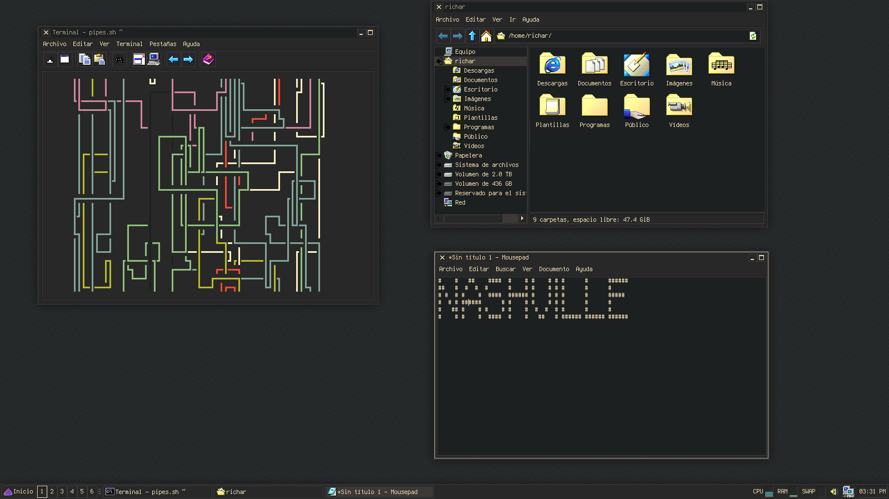

# Nashville Gruvbox

A Windows-like GTK theme based on both Chicago95 (for GTK3) and Redmond97 (for GTK2) incoporating the famous color scheme. *Note:* This was made with XFCE on mind, so you may find issues if you are using another DE.

### Screenshots

### Thanks to 

- [@grassmunk](https://github.com/grassmunk) for [Chicago95](https://github.com/grassmunk/Chicago95).
- [@matthewmx86](https://github.com/matthewmx86) for [Redmond97](https://github.com/matthewmx86/Redmond97).
- [@morhetz](https://github.com/morhetz) for the [Gruvbox color scheme](https://github.com/morhetz/gruvbox).
- [@tpenguinltg](https://github.com/tpenguinltg) for [Windows Classic theme designer](https://github.com/tpenguinltg/winclassic).

### License 
GNU General Public License v3.0
